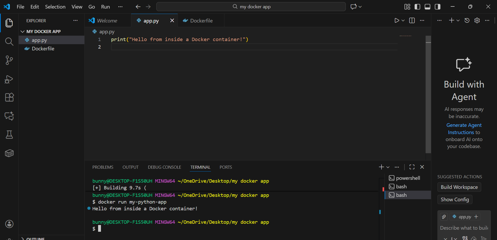
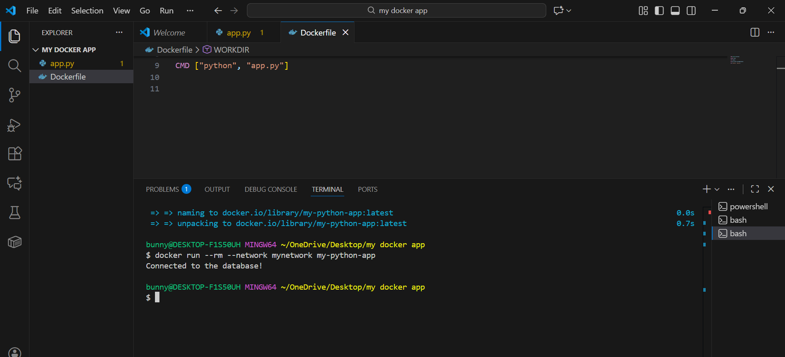

## Dockerized Python + PostgreSQL Project

This project demonstrates how to containerize a Python application and connect it to a PostgreSQL database using Docker.
The Python app creates a table, inserts a row, retrieves the data, and displays it in a clean table format inside the terminal.

## Project Overview

### This project covers:

Creating a Python application

Writing a Dockerfile

Building and running Docker images

Creating a Docker network

Running PostgreSQL in a separate container

Connecting Python to PostgreSQL using psycopg2

Creating a table and inserting data

Printing results using tabulate

Optionally pushing the Docker image to Docker Hub

## Project Structure
```
my-docker-app/
├── app.py              # Python application code
├── Dockerfile          # Dockerfile for building the Python container
├── README.md           # Project documentation
└── images/             # Folder containing project screenshots
    ├── docker1.png
    ├── docker2.png
    └── docker3.png

```


## Python Application

### The Python app:

Waits for PostgreSQL to start

Connects to the database

Drops the old table

Creates a new table (id, name, age, course)

Inserts 1 row into the table

Fetches and prints the result in table format


## Dockerfile

The Dockerfile sets up the Python environment, installs dependencies, and runs the application.

## 1. Writing a Simple Dockerfile (Python App)

Create a folder for your app and inside it create app.py:
```
print("Hello from inside a Docker container!")
```
Create a Dockerfile:
```
FROM python:3.10-slim
WORKDIR /app
COPY app.py .
CMD ["python", "app.py"]
```
### EXpected Output:


## 2. Build and Run Docker Image
### 1. Build the Docker image
```
docker build -t my-python-app .
```
Run the container:
```
docker run my-python-app
```
## 3. Cleaning Up Docker Resources
```
docker ps
docker stop <container_id>
docker rm <container_id>
docker rmi my-python-app
```
## 4. Create a Custom Docker Network and Run PostgreSQL

### 1. Create a Docker network
```
docker network create mynetwork
```

### 2. Run PostgreSQL container
```
docker run -d \
  --name my-postgres \
  --network mynetwork \
  -e POSTGRES_USER=user \
  -e POSTGRES_PASSWORD=pass \
  -e POSTGRES_DB=mydb \
  postgres
```
## 5.Connecting an App Container to PostgreSQL

### 1.Modify Your Python Application
Use the psycopg2 library to connect to PostgreSQL.

### 2.Rebuild Your Docker Image
Run this command inside your project folder:
```
docker build -t my-python-app .
```

### 3. Run the Python app container on the Custom Network
```
docker run --rm --network mynetwork my-python-app
```



### Pushing Image to Docker Hub (Optional)
```
docker login
docker tag my-python-app:latest 9148428653/my-python-app:v1
docker push 9148428653/my-python-app:v1
```
## Sample output:
```
+----+--------+-------+-----------+
| ID | Name   | Age   | Course    |
+----+--------+-------+-----------+
| 1  | Bunny  | 21    | DevOps    |
+----+--------+-------+-----------+
```


## Technologies Used

Python 3.10

PostgreSQL

Docker

Docker Networks

psycopg2 (PostgreSQL driver)

tabulate (Table formatting)
